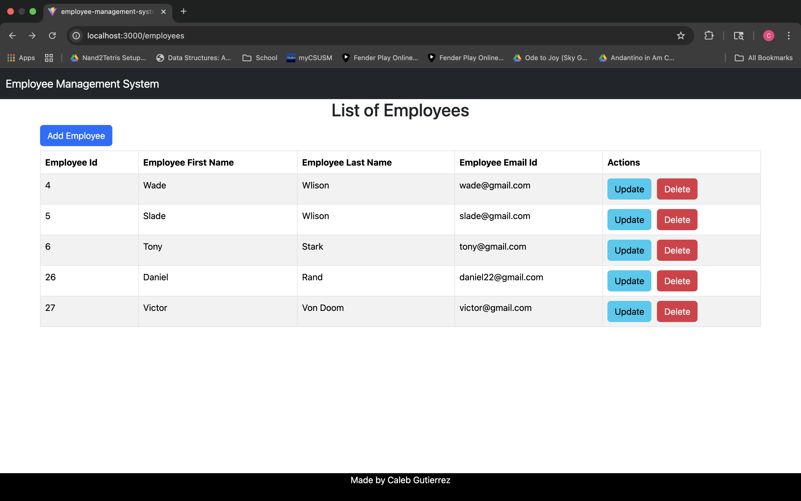
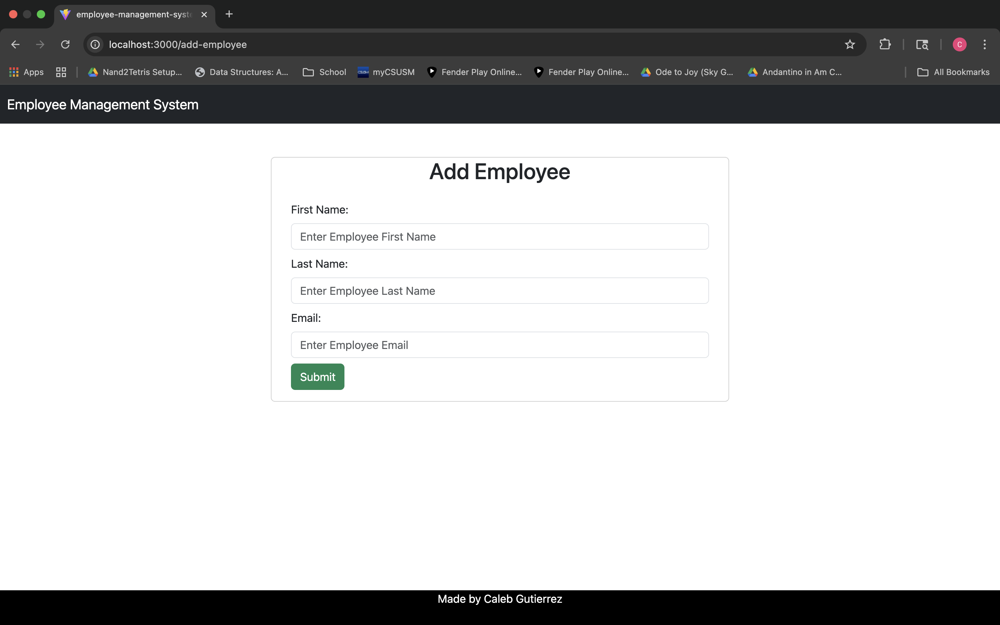
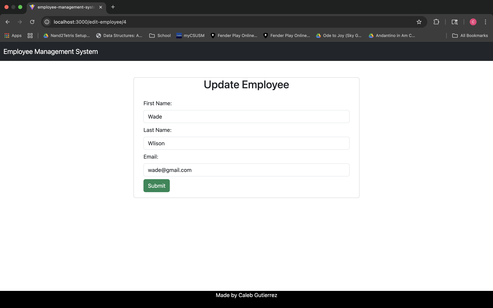

# Employee Management System Frontend

This repository contains the frontend client for Employee Management System built with **React**.  
It provides a responsive and user-friendly interface that communicates with the backend REST API.

# Features 
* React UI
* API integration with backend
* Routing using React Router
* Axios for HTTP requests
* Responsive design

# Tech Stack
* React
* Axios
* React Router Dom
* Bootstrap CSS
* Node.js
* npm

## Screenshots

### Dashboard

### Add Employee Page

### Update Employee Page

